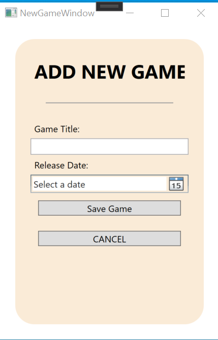

This is plain text

Some more plain text

- [Lists] (#Lists)
- [My h1 header] (#This-is-h1-header)

# Gam3 Sp0t Project

### Description
Gam3 Sp0t is a program designed to provide a community platform for users to view game
details and post and view reviews. Users can create new accounts with different 
levels of access.

###### Accounts
- __*General Account:*__ These are the standard accounts on the application. If a user
creates one of these account then they are only able to view games, as well as upload
reviews on games they've played and would like to share their experience.
- __*Admin Account:*__ Admin has all the same capabilities as the general account but they
also have abilities for customisation of the platform. Admins are able to add, edit
and remove games from the platform, as well as modify developers and platforms for others
to apply to new games. Admins also have user management controls.

###### Features 
- Account Creation
- Game Cataloug
- Game View
- Game Reviews

*These features are all developed using Entity Framework and WPF in C#*

### Visuals
###### Authentication Flow

*Screenshots of the login and registration page (This is the first view displayed
when the project starts up).*

###### Login/Registration Flow

*Screenshots of the main page in `Admin Mode` during `Game Edit`(This is the 
first view displayed when the authentication is successful).*

###### New Game Flow

*Screenshots of creating a `New Game` being added in `Admin Mode`.*

### User Stories

Title         | Priority       | Estimate
--------------|----------------|----------------
Abraham       |Wavendon        |MK

