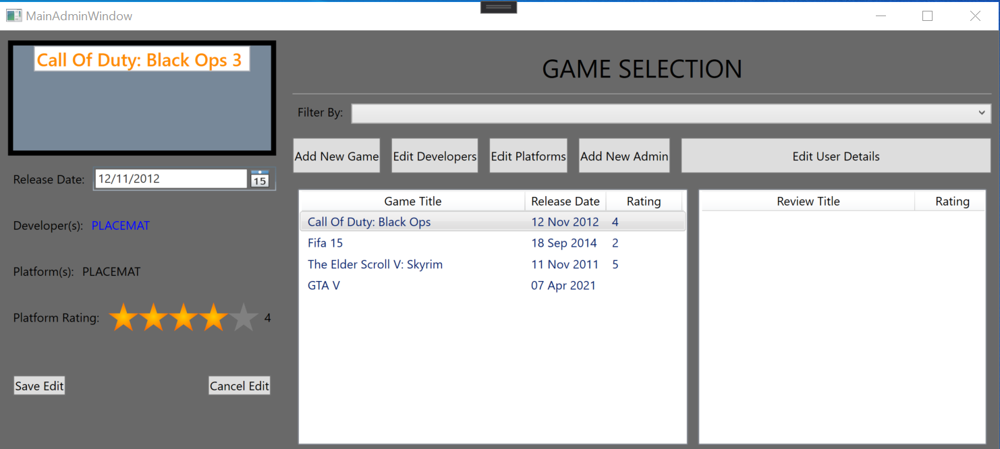

# Gam3 Sp0t Project

### Project Goal & Definition of Done
###### Goal
Develop a program that serves as a games catalouge and reviewing platform.
###### Definition Of Done
- Methods which can store, update and delete game details in a database are created.
- Methods that allows users to write and delete accompanying reviews for games are created.
- A GUI using WPF that invokes CRUD methods is created and all GUI elements works as expected.
- All code is functioning as expected.
- All test run and pass successfully.
- All code has been committed and pushed to the repo.

### Sprints
##### Sprint 1
###### Goal
Create a foundtion for the project. This sould include the 3 layer structure
(business layer, data layer and GUI layer) as well as a GitHub repo that has
been setup with a project board.

###### Sprint Output (DONE)

*Above is a snapshot of the completed tasks and user stories completed in sprint 1.*

###### Sprint Retrospective
**Things that went well:** During this sprint I got to put the 3 layer model into practice for the first time.
By the end of the sprint, a foundation for the application was built. I've been able to clearly identify what has been done,
what works as expected, what dosen't work as expected and what need to be addressed for the next sprint.

**Improvements:** As this was the first time puting the 3 layer model into practice a lot of time was spent playing
around with a database first approach or a model first approach. This came from poor planning of actions when th project
started. To translate this into sprint improvements, before the next sprint starts, plan out the task before starting
to save time on repeated and restarted work. This can be through diagrams or checklist in a Kanban board.

**Action plan:** For the next sprint doccumentation should be the prioritised task. Improvements to the unit tests are
also required along with some code cleaning and refactoring. 

##### Sprint 2
###### Goals
- Refactor and clean code so that its ready to be reviewed for a demo
- Have a demo worthy documentation ready to be shown
- Make an extensive range of unit tests for my business layer

###### Sprint Output (REVIEW)
<!---->

*Above is a snapshot of the completed tasks and user stories completed in sprint 1.*

###### Sprint Retrospective
**Things that went well:** 

**Improvements:** 

**Action plan:** 

### Project Description
Gam3 Sp0t is a program designed to provide a community platform for users to view game
details and post and view reviews. Users can create new accounts with different 
levels of access.

###### Accounts
- __*General Account:*__ These are the standard accounts on the application. If a user
creates one of these account then they are only able to view games, as well as upload
reviews on games they've played and would like to share their experience.
- __*Admin Account:*__ Admin has all the same capabilities as the general account but they
also have abilities for customisation of the platform. Admins are able to add, edit
and remove games from the platform, as well as modify developers and platforms for others
to apply to new games. Admins also have user management controls.

###### Features 
- Account Creation
- Game Cataloug
- Game View
- Game Reviews (TBC)

*These features are all developed using Entity Framework and WPF in C#*

### User Guide
###### Authentication Flow

*Screenshots of the login and registration page (This is the first view displayed
when the project starts up).*

- **1.1** When the application starts up, the Login window (on the right) will appear.
- **1.2** If the user already has details registered then they should input their 
details into the fields of the Login window, else press the `REGISTER` button.
- **1.3** If a user is unregisteed and has pressed the `REGISTER` button then
the Register window (on the left) should appear.
- **1.4** Fill in all the corresponding details and press the `Sign Up` button to
create an account and be returned to the Login window.
- **1.5** Complete steps 1.2 to be authenticated.

###### Main Flow (Admin)

*Screenshots of the main page in `Admin Mode` during `Game Edit`(This is the 
first view displayed when the authentication is successful).*

- **2.1** Once authenticated is succesful and user has been logged in as Admin
then this main window should appear. 
- **2.2** On the left is a view to display selected game details, in the middle
is a list of all games stored in the game catalouge and on the right is a list
of all reviews assosiated with the selected game 
- **2.3** Press on the games in the middle list to change the view of the games
on the left of the application.
- **2.4** An `Edit Game` button can be pressed on the left of the program to get
the view displayed in the screenshot. When in edit mode, the game details can
be modified. 
- **2.5** Buttons are also displayed along the top to navigate round the application.
###### New Game Flow

*Screenshots of creating a `New Game` being added in `Admin Mode`.*
- **3.1** To create a new game simply input the title of the game and enter
its release date into the respected fields shown in the screenshot.
- **3.2** Press the `Save` button to save the game entered or `Cancel` to go 
back to the main flow

